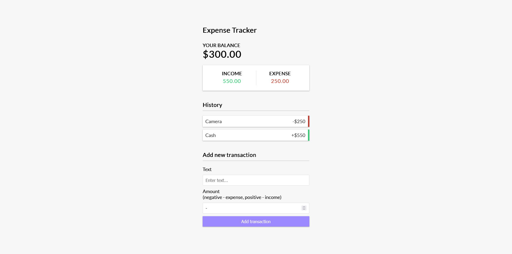

# Expense Tracker

This is a practice repository of the [Expense Tracker React](https://youtu.be/XuFDcZABiDQ?si=XuYOg_SprAf6HePC) project from Traversy Media

## Table of contents

-   [Overview](#overview)
    -   [The challenge](#the-challenge)
    -   [Screenshot](#screenshot)
    -   [Links](#links)
-   [My process](#my-process)
    -   [Built with](#built-with)
    -   [What I learned](#what-i-learned)
    -   [Continued development](#continued-development)
    -   [Useful resources](#useful-resources)
-   [Author](#author)

## Overview

### The challenge

-   Understanding how hooks are used
-   Understanding how states are generally held
-   Understanding how reducers are used

### Screenshot



### Links

-   Solution URL: [GitHub](https://github.com/mikailafsin/expense-tracker-react)
-   Live Site URL: [Vercel](https://expense-tracker-react-brown.vercel.app/)

## My process

### Built with

-   Flexbox
-   [React](https://reactjs.org/) - JS library

### What I learned

In this project, I learnt how to keep states globally with context API and how to manage custom state logic with Reducer.

```jsx
export const GlobalProvider = ({ children }) => {
    const [state, dispatch] = useReducer(AppReducer, initialState);

    const deleteTransaction = (id) => {
        dispatch({
            type: "DELETE_TRANSACTION",
            payload: id,
        });
    };

    const addTransaction = (transaction) => {
        dispatch({
            type: "ADD_TRANSACTION",
            payload: transaction,
        });
    };

    return (
        <GlobalContext.Provider
            value={{
                transactions: state.transactions,
                deleteTransaction,
                addTransaction,
            }}
        >
            {children}
        </GlobalContext.Provider>
    );
};
};
```

### Continued development

I will continue to learn new concepts to use React more effectively in future projects.

### Useful resources

-   [Build an Expense Tracker | React Hooks & Context API](https://youtu.be/XuFDcZABiDQ?si=xQBQGS9YUKgzxqGV) - This helped me to implement the project and understand the concepts.

## Author

-   Instagram - [@mikail.afsin](https://www.instagram.com/mikail.afsin)
